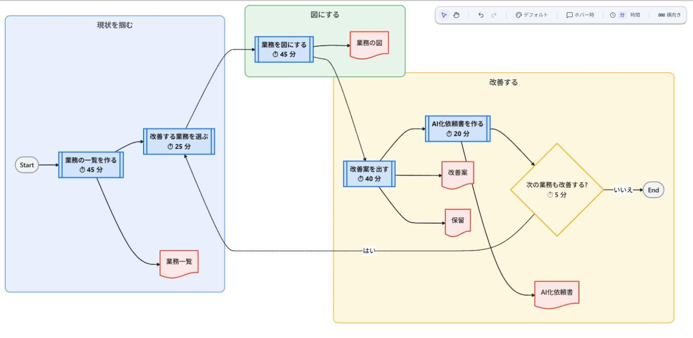
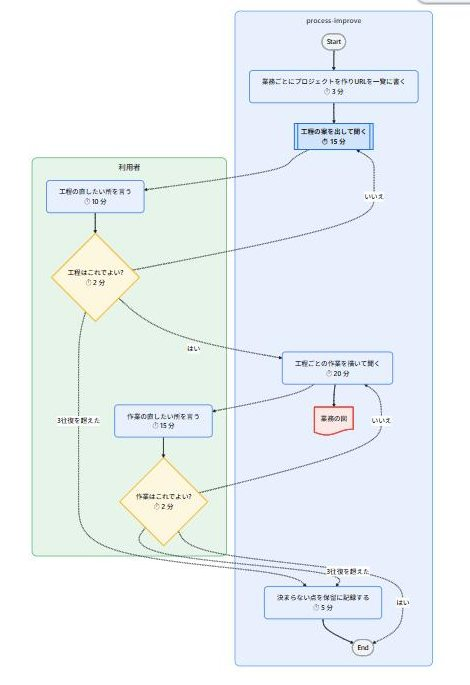
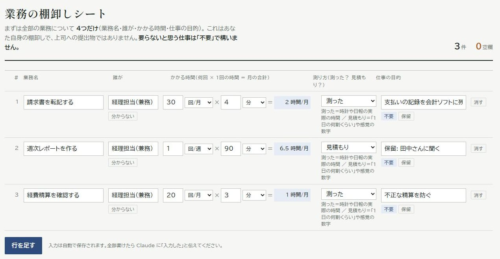
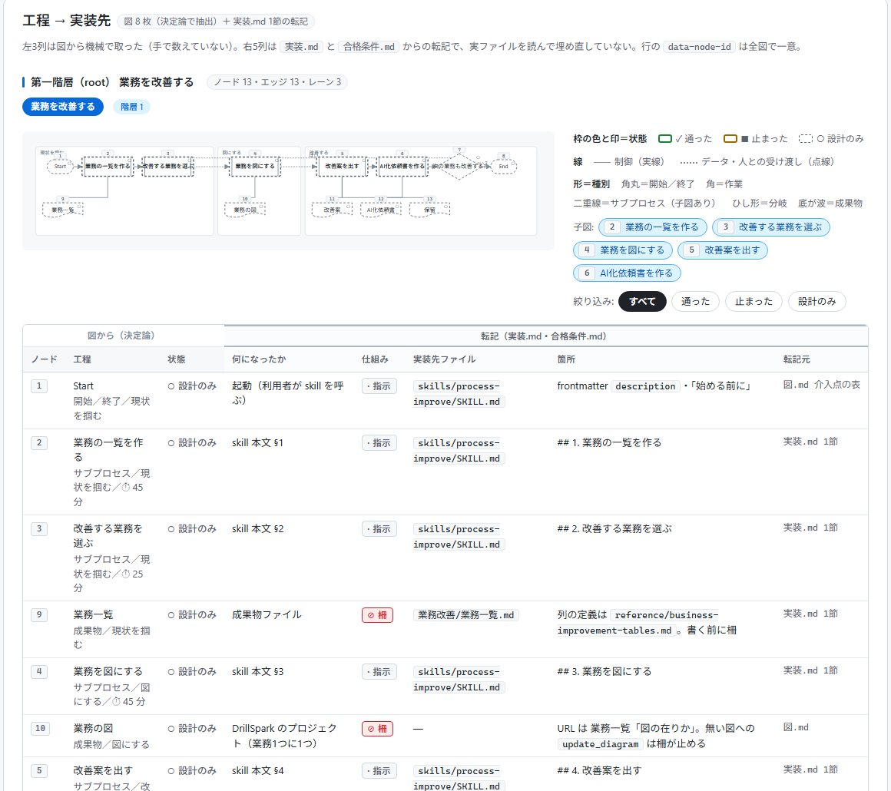

# DrillSpark Harness

> 日本語版: [README.ja.md](README.ja.md)

**Draw the workflow before Claude Code builds its own configuration. Then let a different AI grade the result.**

> Skill and agent bodies are written in Japanese. See [Language](#language).

## The problem

Long instructions to Claude Code are not followed reliably. The "always check with me" you wrote
gets skipped, nobody decided where a human should stop the run, and whatever comes out is declared
finished by the same AI that built it.

This plugin changes the order.

1. **Draw first.** Who does what, in what order, and where a human confirms is drawn as a business
   process diagram in [DrillSpark](https://drillspark.io/), and you approve it one diagram at a
   time. The diagram is the contract.
2. **Build from the diagram.** The approved diagram becomes Claude Code skills, agents, hooks and
   permissions. "Always check with me" becomes a hook that refuses to run without the check.
3. **Grade with a separate AI.** Reviewer agents that did not build anything judge the result
   against a criteria file shipped inside the plugin — outside your repository, so the building
   side cannot edit it.

The same method works on **a human's job**: there are no files to read, so the skill interviews
you, draws the work, and produces a one-page hand-off saying which tasks go to AI and where a
person must approve.



*The plugin's own workflow "improve a business process". The first level is stages only; opening a stage shows its tasks.*

## Try it

### Build a harness

```text
/drillspark-harness:harness-implement  新しいハーネスを作りたい。目的は「ブログ記事を書いて公開する」
```

What happens:

1. **You are asked for the purpose.** Who it is for, what it produces, how success is measured,
   what is out of scope. Saved to `docs/harness/<name>/設計.md`.
2. **A list of workflows is proposed** — one row per independent unit of work, such as "write an
   article" and "publish". You confirm it.
3. **Diagrams are drawn one at a time.** First the skeleton, then the tasks inside each stage.
   After each one, the DrillSpark diagram is shown and you are asked "is this right?". What each
   stage writes to a file, and who inspects a deliverable, are drawn on the diagram too.

   
4. **Pass conditions are shown** — machine-checkable tests derived from the diagram (inputs a hook
   must stop and must let through, lint results). Once you approve them they are frozen.
5. **The files are written.** Skills, agents, hooks and rules land in `.claude/`; a reviewer agent
   checks them against the criteria; the frozen pass conditions run. No human stops here.
6. **The next workflow is a new session.** One run builds one workflow. When all are done,
   `harness-compose` writes `settings.json` and `CLAUDE.md`, and `harness-evaluator` runs real
   tasks through the result.

### Inventory and improve your own work

```text
/drillspark-harness:process-improve  私の業務を棚卸ししたい
```

What happens:

1. **You are asked about your work** — task name, how often, how long, what for. Where the
   `Artifact` tool is available, a one-page inventory sheet opens and you fill one row per task.

   
2. **Tasks are ranked by time.** A script does the ABC analysis. Anything you could not answer
   stays visible as 「未確認: ask so-and-so」 rather than a blank.
3. **The heaviest task becomes a diagram**, one stage at a time, each confirmed with you. Whatever
   the expert agent filled in from general knowledge is marked 「一般例」.
4. **Improvements are asked one question at a time** — eliminate, combine, rearrange, simplify
   (ECRS). The proposal is drawn as a to-be diagram next to the as-is one.
5. **A one-page hand-off is produced**: which tasks to give to AI and how far (H1–H5), where a
   person approves, how much time it saves. Nothing is implemented.

### Review a harness you inherited

```text
/drillspark-harness:harness-improve  このリポジトリのハーネスを見直したい
```

Reads `.claude/`, draws what it currently does, corrects the diagram toward the ideal with you, and
hands the diff to `harness-implement`. It never edits files.

### See one workflow on one page

```text
/drillspark-harness:harness-visualize  「業務を改善する」を1枚にしたい
```

Builds a single HTML page under `docs/harness/<name>/可視化/` that layers the diagram, the design and
the run record. Every node gets one row: what it became, the mechanism (instruction, confirmation,
guard, agent), the file and place that implements it, and its status; diagram, table and source
excerpts link to each other.



*The plugin's own workflow "improve a business process". With no evaluation report yet, every status reads "design only".*

### Terms

| Term | Meaning |
|---|---|
| harness | The configuration handed to Claude Code: `CLAUDE.md`, skills, agents, hooks, permissions |
| 処理 (workflow) | One independent unit of work the harness performs — "write an article", "post an invoice". One workflow = one DrillSpark project |
| 工程 (stage) | A step inside a workflow; the first level of the diagram, with tasks below it |

## Installation

| Requirement | |
|---|---|
| Claude Code | `2.1.233` or later |
| Node.js | 14 or later, on `PATH` (the hooks start `node`; no dependencies) |
| DrillSpark | an account and the MCP server connected |

**1. Connect DrillSpark.** Create an account at [drillspark.io](https://drillspark.io/). A user
without an account gets the coupon code `drill-kaizen` (one month free; entered on the payment
page). **Cancel before the free month ends**, or billing starts.

- **Claude Code** — issue an API key (`dsk_…`) from the [dashboard](https://drillspark.io/dashboard)
  and add `https://drillspark.io/api/mcp/mcp` as an `http` server named `drillspark`
  (`Authorization: Bearer <key>`).
- **Claude Desktop / claude.ai** — link the account from the connector settings.

Check with `/mcp`; connecting mid-session needs a restart. Name the server `drillspark` or use the
claude.ai connector — under any other name the reviewer agents cannot read diagrams. Triage for
connection problems: [`reference/drillspark-setup.md`](reference/drillspark-setup.md) (Japanese).

**2. Install the plugin.**

```bash
/plugin marketplace add drillspark-io/drillspark-harness
/plugin install drillspark-harness@drillspark-harness
```

To try it for one session without installing: `claude --plugin-dir ./drillspark-harness` from a clone.

## What's inside

### Skills

| Skill | Use it when |
|---|---|
| `harness-implement` | Building a new harness, adding a workflow to one, or re-applying a corrected diagram to files |
| `harness-compose` | Every workflow is implemented and `settings.json` / `CLAUDE.md` should be written once |
| `harness-improve` | You inherited a harness, or want the diff between the ideal and what `.claude/` does |
| `harness-visualize` | You want one workflow's diagram, design and run record on a single HTML page |
| `process-improve` | You want to inventory a job and decide what to hand to AI |
| `process-improve-view` | You want the improvement plan on one HTML page |

### Agents

Every agent reports findings and never edits files.

| Agent | Role |
|---|---|
| `harness-design-reviewer` | Reviews diagrams and implementation against the criteria |
| `harness-asis-reviewer` | Checks that an as-is diagram matches the real `.claude/` files |
| `harness-evaluator` | Runs the frozen pass conditions and real tasks, measures the success metric |
| `process-expert` | Proposes stages and tasks for a job from an expert's point of view |
| `process-improve-reviewer` | Judges process-improvement outputs against their criteria file |

### Guards (hooks)

Installing adds three PreToolUse hooks. Nothing is written to your `settings.json`.

| Guard | Stops |
|---|---|
| `harness-view-guard.js` | Overwriting a visualization page, writes past the fix limit, a page that fails its lint |
| `process-write-guard.js` | Tables under `業務改善/` that fail their lint, writes through scripts or redirects, `update_diagram` on a DrillSpark project the plugin did not record |
| `harness-freeze-guard.js` | Changing or removing rows of a frozen pass-condition file |

Everything else passes immediately (one `node` start, about 100 ms). Switch off with
`DRILLSPARK_HARNESS_GUARDS=off`.

### Scripts

Dependency-free Node.js scripts, exit `0` pass / `2` violations / `1` error: diagram structure
lint, visualization-page lint, process table and plan lints, ABC analysis, second-level coverage,
saved-file check. Commands and codes: [docs/design-notes.md](docs/design-notes.md#the-lints).

## Design background

Why the diagram is the contract, why one session builds one workflow, and which recorded
failures produced each rule: [docs/design-notes.md](docs/design-notes.md).

## Language

Skill and agent bodies are Japanese, and that text is the source of truth. If you need an English
edition, open an [issue](https://github.com/drillspark-io/drillspark-harness/issues).

## Contributing

Issues and pull requests: [github.com/drillspark-io/drillspark-harness](https://github.com/drillspark-io/drillspark-harness).
Run `bash tests/run.sh` and `claude plugin validate . --strict` before opening a PR.

## License

Apache-2.0. See [LICENSE](LICENSE).
